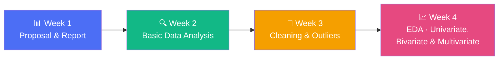

<div align="center">

# 💳 Credit Card Fraud Detection — Data Science & Visualization

### Team 1 · 24ADI204 · Data Science & Visualization Lab

An end-to-end exploratory data analysis project on the [Kaggle Credit Card Transactions Fraud Detection dataset](https://www.kaggle.com/datasets/kartik2112/fraud-detection) — from raw data to cleaned, outlier-handled, and visualized insights.


[Dataset](#-dataset) • [Project Timeline](#-project-timeline-week-by-week) • [Repo Structure](#-repository-structure) • [How to Run](#-how-to-run) • [Key Findings](#-key-eda-findings) • [Team](#-team)

</div>

---

## 📖 About

This repository documents a **four-week lab progression** for the Credit Card Fraud Detection project, built as part of the Data Science & Visualization course. Each week builds on the last — starting from raw data understanding, moving through cleaning and outlier handling, and finishing with univariate, bivariate, and multivariate exploratory data analysis (EDA).

> **Target variable:** `is_fraud` — a highly imbalanced binary classification target, which shapes much of the analysis approach throughout this project.

---

## 🗂 Dataset

| | |
|---|---|
| **Source** | [Kaggle — Credit Card Transactions Fraud Detection Dataset](https://www.kaggle.com/datasets/kartik2112/fraud-detection) by `kartik2112` |
| **Files used** | `fraudTrain.csv`, `fraudTest.csv` |
| **Target variable** | `is_fraud` |
| **Key numerical features** | `amt`, `city_pop`, `lat`, `long`, `merch_lat`, `merch_long` |
| **Key categorical features** | `category`, `gender`, `state`, `job` |

<details>
<summary>⚠️ <b>Note on dataset files in this repo</b></summary>
<br>

The CSVs in <code>archive (2)/</code> and <code>Week 3/fraudTrain_cleaned.csv</code> are tracked via **Git LFS**. Make sure you have [Git LFS](https://git-lfs.com/) installed and run `git lfs pull` after cloning, or download the dataset directly from Kaggle using the link above.

</details>

---

## 🗓 Project Timeline (Week-by-Week)



<table>
<tr>
<th>Week</th><th>Focus</th><th>Deliverables</th>
</tr>
<tr>
<td align="center">1️⃣</td>
<td>Project proposal & problem framing</td>
<td>

- 📄 `DSV_Team1_Week1_Lab_Report_CreditCardFraudDetection.docx`
- 📊 `Credit_Card_Fraud_Detection.pptx`

</td>
</tr>
<tr>
<td align="center">2️⃣</td>
<td>Dataset structure, statistical & target-variable analysis</td>
<td>

- 📓 `data_analysis.ipynb`

</td>
</tr>
<tr>
<td align="center">3️⃣</td>
<td>Outlier detection (IQR method) & data cleaning / visualization</td>
<td>

- 📓 `Outlier_Analysis.ipynb`
- 📓 `week3 data_visualization.ipynb`
- 📝 `week3data cleaning report.odt`
- 🔗 `colab_link.md`
- 🧾 `fraudTrain_cleaned.csv`

</td>
</tr>
<tr>
<td align="center">4️⃣</td>
<td>Full EDA — univariate, bivariate & multivariate analysis</td>
<td>

- 📓 `Fraud_Detection_EDA_Univariate_Analysis.ipynb`
- 📓 `Bivariate_Multivariate_EDA.ipynb`
- 📕 `Credit_Card_Fraud_EDA_Report.pdf`

</td>
</tr>
</table>

---

## 📁 Repository Structure

```
24ADI204_DSV_Team1/
│
├── Week 1/
│   ├── Credit_Card_Fraud_Detection.pptx
│   └── DSV_Team1_Week1_Lab_Report_CreditCardFraudDetection.docx
│
├── Week 2/
│   └── data_analysis.ipynb
│
├── Week 3/
│   ├── Outlier_Analysis.ipynb
│   ├── week3 data_visualization.ipynb
│   ├── week3data cleaning report.odt
│   ├── colab_link.md
│   └── fraudTrain_cleaned.csv          (Git LFS)
│
├── Week 4/
│   ├── Fraud_Detection_EDA_Univariate_Analysis.ipynb
│   ├── Bivariate_Multivariate_EDA.ipynb
│   └── Credit_Card_Fraud_EDA_Report.pdf
│
└── archive (2)/
    ├── fraudTrain.csv                  (Git LFS)
    └── fraudTest.csv                   (Git LFS)
```

---

## 🚀 How to Run

<details open>
<summary><b>Option A — Google Colab (recommended, zero setup)</b></summary>
<br>

Open the Week 3 notebook directly in Colab:

➡️ **[Launch in Google Colab](https://colab.research.google.com/drive/17RQqWje2Pausdl7xxV0rCsfPljlTI9sA?usp=sharing)**

</details>

<details>
<summary><b>Option B — Run locally</b></summary>
<br>

```bash
# 1. Clone the repository
git clone https://github.com/sudarshinib2405-sys/24ADI204_DSV_Team1.git
cd 24ADI204_DSV_Team1

# 2. Pull the large dataset files (Git LFS)
git lfs pull

# 3. Install common dependencies
pip install pandas numpy matplotlib seaborn jupyter

# 4. Launch Jupyter and open any notebook
jupyter notebook
```

Notebooks are written to auto-detect the dataset path across **Kaggle, Colab, Jupyter, and VS Code** environments, so they should run with minimal path changes.

</details>

---

## 🔎 Key EDA Findings

The analysis pipeline across notebooks covers:

- ✅ **Dataset understanding** — dimensions, column types, sample records
- ✅ **Data quality checks** — missing values, duplicates, constant columns, invalid/negative amounts
- ✅ **Outlier handling** — IQR-based detection on transaction amounts
- ✅ **Class-imbalance analysis** — `is_fraud` distribution (counts & percentages)
- ✅ **Univariate analysis** — individual feature distributions
- ✅ **Bivariate & multivariate analysis** — relationships between features and fraud likelihood

📕 Full write-up available in [`Week 4/Credit_Card_Fraud_EDA_Report.pdf`](./Week%204/Credit_Card_Fraud_EDA_Report.pdf)

---

## 🛠 Tech Stack

<div align="left">


</div>

---

## 👥 Team

**Team 1 · 24ADI204 — Data Science & Visualization**

| Member | Notes |
|---|---|
| Sudarshini 25BAD116 | Repository owner |
| Suhani Parveen 25BAD119 | Contributor |
| Shreya 25BAD105 | Contributor |
| Thanesha V 25BAD125 | Contributor |


---

<div align="center">

*Built for the 24ADI204 Data Science & Visualization Lab*

</div>
